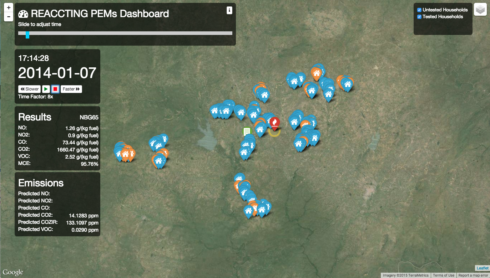

# REACCTING Data Application

If you have issues, please submit them to the issue tracker.  Further details on using this app can be viewed in App/templates/howToUse.html and App/templates/dataDocumentation.html.

The prezi presentation included this repository shows the process that went into developing this app.  The undergraduate honors thesis that coincides with this process can be found on [CU Scholar](http://scholar.colorado.edu/honr_theses/941/) and a blog post regarding the technical tools is currently underway at [my website](http://alexianewgord.com).

## Steps to run this application on your local machine

#### 1. Pull down the code/application from git

* Install git and create an account if you haven't already
* Ask Alexia to be added as a "collaborator" if you're not one yet (since the project is private)
* Run the following in the directory that you want the project to be stored:
```
git clone https://github.com/alne4294/REACCTING.git"
```
* To update your current application, run:
```
git pull origin master
```

#### 2. Set up the Mongo Database

* Install Mongo Database if you don't have it.  See this installation directions here.  This app was developed on version 2.6.7.
* Import the PEMs data dump by running:
```
mongorestore --collection p1 --db pems PEMs_data/dump/pems/p1.bson
```
It's less than a gig and should have 6343 records.
* Start the MongoDB daemon with:
```
mongod
```

#### 3. Check Python Requirements

* Make sure your machine has all of the requirements by running the following from the base folder of the app. 
```
pip install -r requirements.txt
```
If there are errors, you may be missing some dependencies... go ahead and install those as well.
This app was developed using Python 2.7.6 and has only been tested with Firefox, Safari, and Chrome.

#### 4. Run

* Run the application with:
```
python app.py
```
* You can view the app by going to http://localhost:5000/.  
* Clickling on Pems Animation should route you to http://localhost:5000/pemsAnimation and look like this:



* It may ask for authentication, and the username and password can be found in the code in app.py.

#### 5. Debug?

* If there are issues, check for error messages in your terminal and browser console (by using inspector or other tool)

#### 6. Improve

* Create issues [here](https://github.com/alne4294/REACCTING/issues) for problems or features that can/should be added 
* OR add them yourself.  If you are confident in your changes, pull the latest changes with "git pull origin master" and then push your changes to the online repository with the following commands:
```
git add *
git commit -m "I modified this part because..."
git push origin master
```
Please be verbose with your commit message and, ideally, make your own issue and resolve it :)


